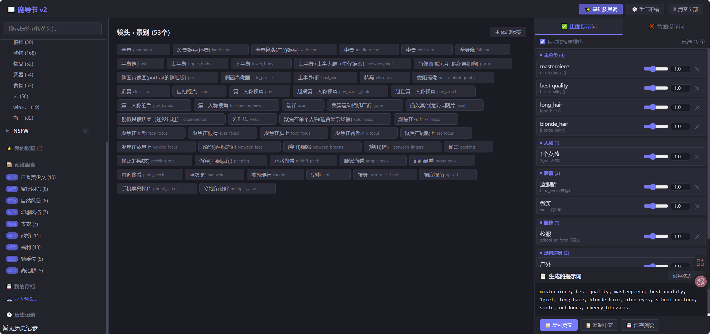
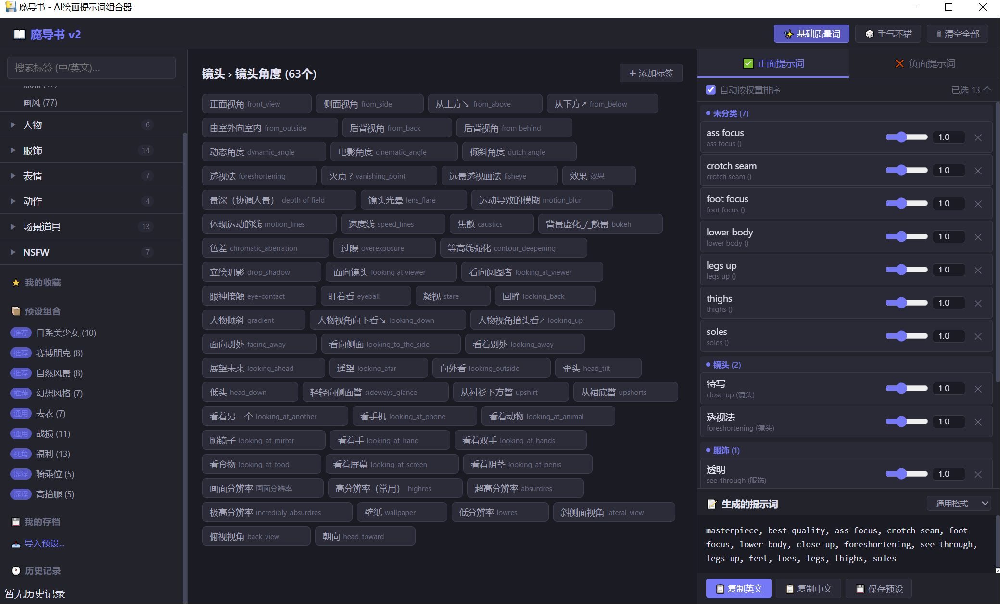

# 📖 魔导书 Grimoire — AI提示词组合器

> **由 AI 生成 | AI-Generated Project**

魔导书是一款面向 AI 绘画创作者的提示词（Prompt）组合与管理工具。它帮助用户通过分类标签快速组合高质量提示词，支持 Web 端和桌面客户端两种使用方式。

---

## ✨ 功能 Features

- **标签化提示词管理** — 按镜头、风格、光照、色彩、构图等分类管理和浏览提示词
- **快速组合器** — 点击标签即可组合完整 Prompt，一键复制使用
- **基础质量词** — 一键添加画质增强前缀词
- **随机手气** — 🎲 随机组合 Prompt，激发创作灵感
- **标签扩展** — 支持自定义添加标签类别和内容
- **历史记录** — 自动保存使用历史，方便回溯
- **桌面版可用** — exe-v2 提供独立桌面客户端（基于 PyWebView）

---

## 📦 项目结构 Structure

`
魔导书/
├── v2/                    # Web 版 (Flask)
│   ├── server.py          # Flask 后端服务
│   ├── launch.py          # 启动脚本（自动安装依赖 + 打开浏览器）
│   ├── start.bat          # Windows 快捷启动
│   ├── static/            # 前端资源
│   │   ├── index.html     # 主页面
│   │   ├── style.css      # 样式表
│   │   └── app.js         # 前端逻辑
│   └── data/              # 标签数据
│       └── tags.json      # 提示词标签库
│
└── exe-v2/                # 桌面客户端版 (PyWebView)
    ├── 魔导书.py           # 桌面应用源码
    ├── dist/               # 编译后的可执行文件
    │   └── 魔导书.exe       # Windows 独立运行程序
    ├── static/             # 前端资源
    └── data/               # 标签数据
`

---

## 🚀 快速开始 Quick Start

### Web 版 (v2)

**环境要求：** Python 3.8+

`bash
# 进入 v2 目录
cd v2

# 启动服务（自动安装 Flask + openpyxl 依赖）
python launch.py
`

启动后浏览器会自动打开 http://127.0.0.1:5801

或者手动启动：

`bash
cd v2
pip install flask openpyxl
python server.py
`

### Windows 一键启动

双击 v2/start.bat 即可自动运行。

### 桌面客户端 (exe-v2)

直接运行 exe-v2/dist/魔导书.exe，无需安装 Python 环境。

---

---

## 📸 截图 Screenshots

### Web 版 (v2) — 浏览器运行

> **v2 Web 版** 基于 Python Flask 框架，在浏览器中运行。需要本地安装 Python 3.8+ 环境，启动后自动打开浏览器访问 `http://127.0.0.1:5801`。

### 桌面客户端 (exe-v2) — 单文件运行

> **exe-v2 桌面版** 为独立可执行文件（基于 PyWebView + PyInstaller 打包），无需安装 Python 环境，下载后双击即可运行，适合非技术用户使用。
## ⚙️ 配置说明 Configuration

### 标签数据

v2/data/tags.json 包含所有提示词分类标签，支持按以下维度分类：

| 维度 | 说明 |
|------|------|
| 🎥 镜头 | 全景、特写、航拍、鱼眼等 |
| 🎨 风格 | 写实、二次元、赛博朋克、水墨等 |
| ☀️ 光照 | 自然光、逆光、霓虹灯、体积光等 |
| 🌈 色彩 | 高饱和、莫兰迪、黑白、渐变色等 |
| 📐 构图 | 三分法、对称、引导线、框架等 |
| 🖼️ 画面 | 景深、动感模糊、粒子、光晕等 |

### 自定义扩展

编辑 tags.json 即可添加自定义标签分类和内容，格式直观易懂。

### 端口配置

默认端口为 5801，如需修改请编辑 server.py 中的端口参数。

---

## 🖥️ 技术栈 Tech Stack

- **后端：** Python + Flask
- **前端：** 原生 HTML + CSS + JavaScript（无框架依赖）
- **桌面版：** PyWebView（Web 界面封装为桌面应用）
- **打包：** PyInstaller（exe-v2 打包为独立 exe）

---

## 📄 开源许可 License

本项目基于 MIT 许可证开源 — 详见 [LICENSE](LICENSE) 文件。

---

## 🤖 说明 Notice

本项目代码由 AI 辅助生成，旨在为 AI 绘画创作者提供一个轻量、好用的提示词管理工具。欢迎自由使用、修改和分发。
