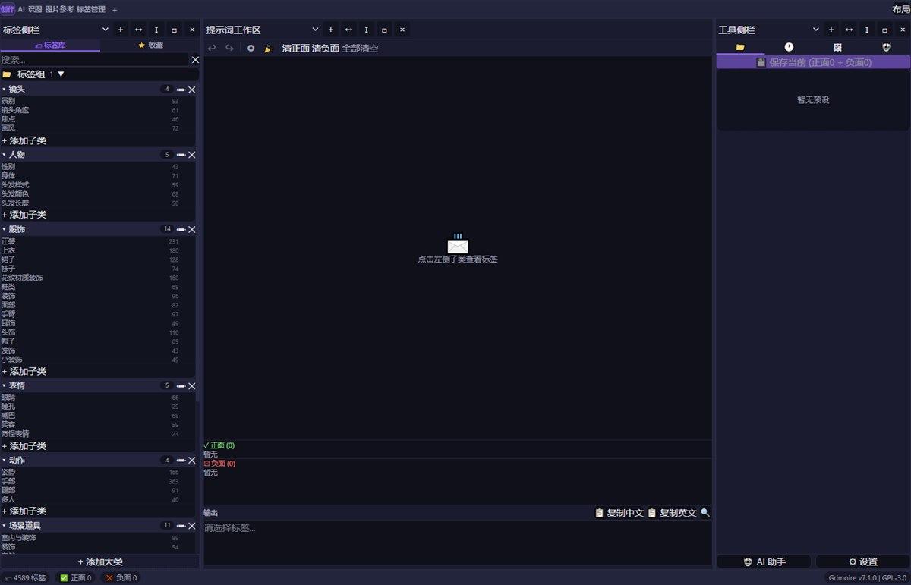
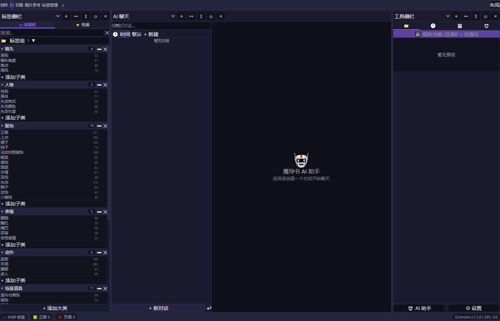
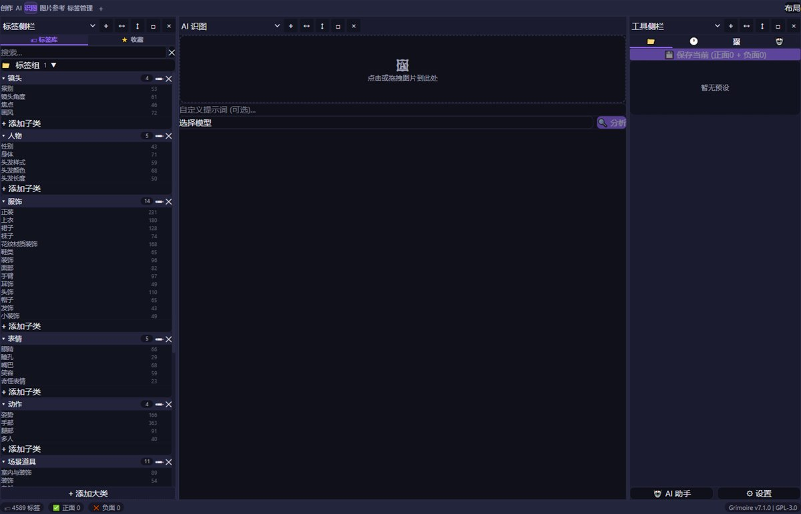
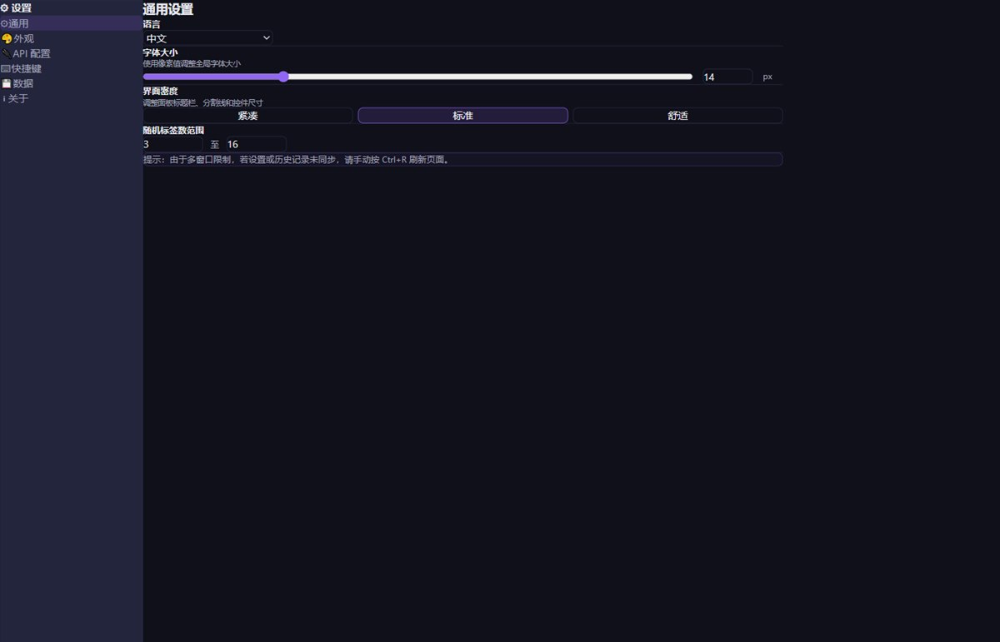

# 魔导书 Grimoire v7.2.0 发行说明

> v7.2 稳定性与资产工作流更新 | 2026-09-10

---

## 下载

| 文件 | 说明 |
|------|------|
| `Grimoire 7.2.0.exe` | 免安装单文件版，下载后直接运行 |
| `Grimoire-portable-7.2.0.zip` | ZIP 便携版，解压后运行 |
| `Grimoire Setup 7.2.0.exe` | NSIS 安装包 |
| `SHA256SUMS-v7.2.0.txt` | SHA-256 完整性校验 |

---

## 重点更新

- **无限画布持久化**：项目文档作为单一状态源，新增 revision 保护、串行保存队列、失败重试和切换工作区保护。
- **提示词资产分类**：无限画布提示词库和工具侧栏支持来源、分类、子分类折叠，支持拖拽移动和自定义分类。
- **预览窗口**：主应用和画布统一支持标题栏拖动、八方向缩放、内容滚动和 footer 分层。
- **图片预览**：支持 0.1–10 倍缩放、鼠标中心缩放和左键拖动。
- **主题同步**：主窗口、工具栏小设置和画布 iframe 使用统一主题偏好。
- **布局优化**：设置页、Provider 卡片、资产卡片、弹窗和面板边界增加合理缓冲。

- **自由多面板工作区**：新增类似 Blender 的工作区/面板逻辑，支持面板切换、左右/上下分割、角点拖拽、相邻面板合并、关闭面板接管空间。
- **工作区布局系统**：新增创作 / AI / 识图 / 图片参考 / 标签管理工作区，支持创建布局、重命名布局、保存/覆盖布局预设。
- **界面外观优化**：优化顶部标题栏、面板边界、按钮可见性、弹出菜单、设置页结构、收藏页层级。
- **主题与显示设置**：字体大小改为 px 滑块，界面密度、强调色、背景色、边框色等设置可保存。
- **可用性修复**：修复文档乱码显示、局部 UI 文案、滚动区域缺失、复制区被挤出、下拉菜单遮挡、拖拽光标闪烁等影响使用的问题。
- **布局稳定性**：增强布局数据清理，避免异常比例、重复面板 id、过深嵌套导致布局保存异常。

---

## 界面截图

| 创作工作区 | AI 工作区 |
|---|---|
|  |  |

| 识图工作区 | 外观设置 |
|---|---|
|  |  |

原始截图保存在 `docs/screenshots/original/`，用于视频素材和宣传图二次制作。

---

## 已知说明

- 本次重点是 v7.1 交互和 UI 重构，布局导入/导出暂未加入。
- 如果从旧版本升级后布局显示异常，可在布局菜单中使用重置功能恢复默认布局。

---

*Grimoire v7.2.0 — AGPL-3.0-or-later License*
